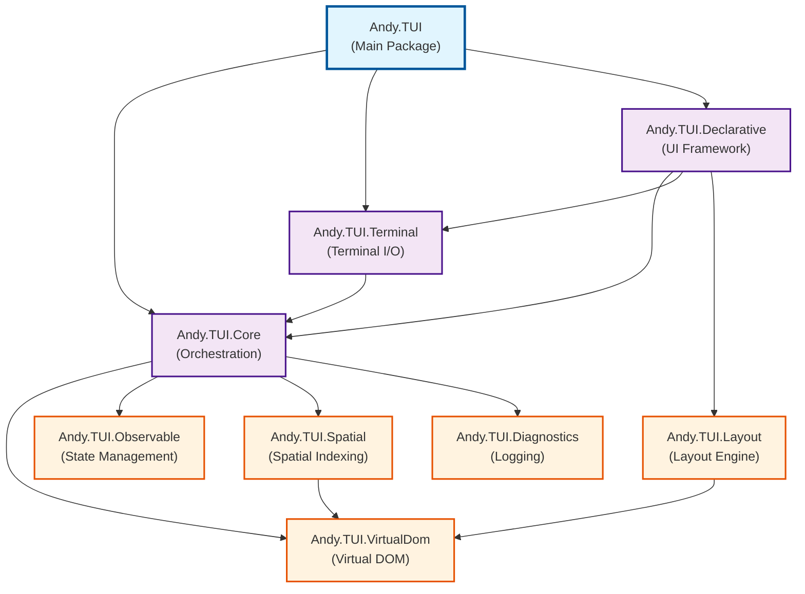

# Andy.TUI

A declarative terminal UI framework for .NET that combines the best of Ink, Yoga, SwiftUI, and WPF.

> ⚠️ **Early Development Warning**
> 
> Andy.TUI is currently in active development and is **not ready for production use**. The library is incomplete with many features that are partially implemented or don't work correctly yet. APIs are subject to breaking changes without notice. 
> 
> **Known Issues:**
> - Rendering system currently uses two conflicting paths (element-based RenderElement and visitor-based Accept), which can cause double-rendering and positioning glitches. We are unifying this into a single rendering approach.
> - Incremental patching in `VirtualDomRenderer` has known clearing/duplication bugs in some move/resize scenarios; some flows temporarily force full re-renders as a workaround.
> - Clipping behavior is inconsistent and will be implemented in the unified renderer.
> - API inconsistencies when adding children are being standardized (declarative components use collection-initializer syntax; virtual DOM nodes are built via builders/`AddChild`).
> - Some layout edge cases remain; performance optimizations are ongoing; cross‑platform behavior continues to be refined.
> 
> We welcome contributors and early adopters who are interested in helping shape the framework, but please be aware of its experimental nature.

## Overview

Andy.TUI is a terminal user interface library that brings declarative UI patterns to console applications. It combines:

- **Ink's rich component library** and developer experience
- **Yoga's flexbox layout engine** for precise positioning
- **SwiftUI's type safety** and declarative syntax
- **WPF's MVVM patterns** and data binding

See [DECLARATIVE_ARCHITECTURE.md](docs/DECLARATIVE_ARCHITECTURE.md) for the complete architecture overview.

## Project Structure

The framework is organized into modular projects, each with specific responsibilities:

### Core Libraries

- **[Andy.TUI.Core](src/Andy.TUI.Core/Andy.TUI.Core.md)** - Core orchestration layer

  - Observable system: `ObservableProperty<T>`, `ComputedProperty<T>`, `ObservableCollection<T>`, `DependencyTracker`
  - Virtual DOM: node types (Text, Element, Fragment, Component), `VirtualDomBuilder`, `DiffEngine` with keyed reconciliation

- **[Andy.TUI.Terminal](src/Andy.TUI.Terminal/Andy.TUI.Terminal.md)** - Terminal interaction layer

  - Terminal abstraction: `ITerminal`, `AnsiTerminal` with ANSI control, cursor, colors, and styles
  - Rendering: `TerminalBuffer` (double buffering, dirty regions), `RenderScheduler` (FPS, batching), `RenderingSystem`
  - Input: `ConsoleInputHandler`, `EnhancedConsoleInputHandler`, cross‑platform key handling

- **[Andy.TUI.Declarative](src/Andy.TUI.Declarative/Andy.TUI.Declarative.md)** - Declarative UI framework
  - SwiftUI-inspired declarative renderer with retained view instances and Virtual DOM diffing
  - Components: `Text`, `Button`, `TextField`, `TextArea`, `Dropdown<T>`, `SelectInput<T>`, `MultiSelectInput<T>`, `Table<T>`, `Checkbox`, `RadioGroup<T>`, `List`, `ProgressBar`, `Spinner`, `Gradient`, `BigText`, `Slider`, `Badge`, `Modal`, `TabView`
  - Focus and events: `FocusManager`, `EventRouter`, tab navigation, basic hit testing
  - Integrates with Andy.TUI.Layout for positioning and layout management

### Supporting Libraries

- **[Andy.TUI.Layout](src/Andy.TUI.Layout/Andy.TUI.Layout.md)** - Flexbox-based layout system with constraints
  - Stack layouts: `VStack`, `HStack`, `ZStack` for organizing components
  - Flexbox properties: `FlexDirection`, `JustifyContent`, `AlignItems`, `FlexWrap`
  - Layout constraints: min/max dimensions, flex grow/shrink, spacing and padding
  - Layout box model with absolute and relative positioning
- **[Andy.TUI.VirtualDom](src/Andy.TUI.VirtualDom/Andy.TUI.VirtualDom.md)** - Virtual DOM implementation with efficient diffing
- **[Andy.TUI.Observable](src/Andy.TUI.Observable/Andy.TUI.Observable.md)** - Reactive state management system
- **[Andy.TUI.Spatial](src/Andy.TUI.Spatial/Andy.TUI.Spatial.md)** - Spatial indexing and occlusion culling
- **[Andy.TUI.Diagnostics](src/Andy.TUI.Diagnostics/Andy.TUI.Diagnostics.md)** - Logging and debugging capabilities

### Main Package

- **[Andy.TUI](src/Andy.TUI/Andy.TUI.md)** - Main NuGet package that bundles all components

See [docs/README.md](docs/README.md) for API references and additional documentation.

## Project Dependencies

The following diagram shows the dependencies between the framework libraries:



### Dependency Layers

1. **Foundation Layer** (No dependencies)
   - `Andy.TUI.Diagnostics` - Logging infrastructure
   - `Andy.TUI.Observable` - Reactive state management
   - `Andy.TUI.VirtualDom` - Virtual DOM implementation

2. **Infrastructure Layer** 
   - `Andy.TUI.Spatial` - Depends on VirtualDom for spatial elements
   - `Andy.TUI.Layout` - Depends on VirtualDom for layout nodes

3. **Core Layer**
   - `Andy.TUI.Core` - Orchestrates VirtualDom, Observable, Spatial, and Diagnostics

4. **Application Layer**
   - `Andy.TUI.Terminal` - Depends on Core for rendering abstractions
   - `Andy.TUI.Declarative` - Depends on Core, Terminal, and Layout

5. **Distribution Layer**
   - `Andy.TUI` - Main package that bundles Core, Terminal, and Declarative

## Getting Started

### Prerequisites

- .NET 8.0 SDK or later

### Building

```bash
dotnet build
```

### Running Tests

```bash
dotnet test
```

### Running Examples

```bash
# Observable examples (properties, collections)
dotnet run --project examples/Andy.TUI.Examples           # lists available
dotnet run --project examples/Andy.TUI.Examples observable
dotnet run --project examples/Andy.TUI.Examples collection

# Virtual DOM examples
dotnet run --project examples/VirtualDom basic
dotnet run --project examples/VirtualDom advanced
dotnet run --project examples/VirtualDom reactive

# Terminal and rendering examples
dotnet run --project examples/Andy.TUI.Examples.Terminal   # lists available
dotnet run --project examples/Andy.TUI.Examples.Terminal terminal-basic
dotnet run --project examples/Andy.TUI.Examples.Terminal rendering-basic

# Declarative input showcase menu
dotnet run --project examples/Andy.TUI.Examples.Input
```

## Example Usage

### Observable Properties

```csharp
// Create observable properties
var firstName = new ObservableProperty<string>("John");
var lastName = new ObservableProperty<string>("Doe");

// Create a computed property that depends on other observables
var fullName = new ComputedProperty<string>(() =>
    $"{firstName.Value} {lastName.Value}");

// Subscribe to changes
fullName.Subscribe(name => Console.WriteLine($"Name: {name}"));

// Changes automatically propagate
firstName.Value = "Jane"; // Output: "Name: Jane Doe"
```

### Observable Collections

```csharp
// Create an observable collection
var tasks = new ObservableCollection<string>();

// Create computed properties based on the collection
var taskCount = new ComputedProperty<int>(() => tasks.Count);
var summary = new ComputedProperty<string>(() =>
    $"You have {tasks.Count} tasks");

// Batch operations
tasks.AddRange(new[] { "Task 1", "Task 2", "Task 3" });

// Suspend notifications for multiple changes
using (tasks.SuspendNotifications())
{
    tasks.Add("Task 4");
    tasks.RemoveAll(t => t.Contains("2"));
    tasks[0] = "Updated Task";
} // Single notification fired here
```

### Virtual DOM

```csharp
using static Andy.TUI.Core.VirtualDom.VirtualDomBuilder;

// Build UI declaratively
var ui = VBox()
    .WithClass("app")
    .WithChildren(
        Label().WithText($"Count: {counter.Value}"),
        HBox()
            .WithChildren(
                Button()
                    .WithText("Increment")
                    .OnClick(() => counter.Value++),
                Button()
                    .WithText("Reset")
                    .OnClick(() => counter.Value = 0)
            )
    )
    .Build();

// Efficient updates with diffing
var diffEngine = new DiffEngine();
var patches = diffEngine.Diff(oldTree, newTree);
// Apply only the minimal changes needed
```

### Terminal Abstraction

```csharp
using Andy.TUI.Terminal;

// Create a terminal with double buffering
var terminal = new AnsiTerminal();
using var renderingSystem = new RenderingSystem(terminal);
renderingSystem.Initialize();

// Apply styles and colors
var style = Style.Default
    .WithForegroundColor(Color.Blue)
    .WithBackgroundColor(Color.White)
    .WithBold();

renderingSystem.WriteText(10, 5, "Hello, TUI!", style);
renderingSystem.DrawBox(0, 0, 80, 24, style, BoxStyle.Double);
renderingSystem.Render();

// Handle input
var inputHandler = new ConsoleInputHandler();
inputHandler.KeyPressed += (_, e) =>
{
    if (e.Key == ConsoleKey.Escape)
        Environment.Exit(0);
};
```

### Declarative Components

```csharp
using Andy.TUI.Declarative;
using Andy.TUI.Declarative.Components;
using Andy.TUI.Declarative.Layout;

// Minimal declarative layout (static example)
var terminal = new AnsiTerminal();
using var renderingSystem = new RenderingSystem(terminal);
var renderer = new DeclarativeRenderer(renderingSystem);

renderingSystem.Initialize();

renderer.Run(() =>
    new VStack(spacing: 1) {
        new Text("Andy.TUI Demo").Bold().Color(Color.Cyan),
        new HStack(spacing: 2) {
            new Text("Welcome to the demo"),
            new Button("OK", () => Environment.Exit(0))
        }
    }
);
```

### Declarative Input

See a complete, working menu that exercises `TextField`, `Dropdown`, `Button`, `TextArea`, `SelectInput`, `Table`, `Modal`, and more:

```bash
dotnet run --project examples/Andy.TUI.Examples.Input
```

## Debugging

Andy.TUI includes a comprehensive debug logging system that helps diagnose issues with rendering, event routing, and state management.

### Enabling Debug Logging

Set the `ANDY_TUI_DEBUG` environment variable to enable debug logging:

```bash
# Enable debug logging with default level (Debug)
export ANDY_TUI_DEBUG=1

# Set specific log level (Debug, Info, Warning, Error)
export ANDY_TUI_DEBUG=Info

# Run your application
dotnet run --project examples/Andy.TUI.Examples.Input
```

### Debug Output Location

By default, debug logs are written to timestamped directories in your system's temp folder:

- **macOS/Linux**: `/tmp/andy-tui-debug/YYYYMMDD_HHMMSS/`
- **Windows**: `%TEMP%\andy-tui-debug\YYYYMMDD_HHMMSS\`

You can customize the log directory:

```bash
export ANDY_TUI_DEBUG_DIR=/path/to/custom/logs
```

### Log Categories

The debug system organizes logs by category:

- **DeclarativeRenderer**: Rendering cycles, virtual DOM updates, and patch application
- **FocusManager**: Focus changes and keyboard navigation
- **EventRouter**: Event routing and handling
- **ViewInstanceManager**: Component lifecycle and instance management
- **SelectInputInstance**: SelectInput-specific behavior and state changes

### Reading Debug Logs

Each category gets its own log file:

```
/tmp/andy-tui-debug/20250804_175311/
├── DeclarativeRenderer.log
├── EventRouter.log
├── FocusManager.log
└── ViewInstanceManager.log
```

Example log output:

```
[2025-08-04 17:53:11.123] [DEBUG] [DeclarativeRenderer] Render requested, executing render cycle
[2025-08-04 17:53:11.124] [DEBUG] [DeclarativeRenderer] Virtual DOM rendered
[2025-08-04 17:53:11.125] [DEBUG] [DeclarativeRenderer] Performing full render
[2025-08-04 17:53:11.126] [DEBUG] [DeclarativeRenderer] Buffer dirty state before flush: True
[2025-08-04 17:53:11.127] [DEBUG] [DeclarativeRenderer] Forced render flush
```

### Common Debugging Scenarios

1. **UI Not Updating**: Check `DeclarativeRenderer.log` for render cycles and patch application
2. **Keyboard Input Issues**: Check `EventRouter.log` and `FocusManager.log`
3. **Component State Problems**: Check the specific component's log file
4. **Performance Issues**: Look for excessive render cycles or large patch counts

### Comprehensive logging in tests

For richer logs during automated tests, initialize the comprehensive logging system:

```csharp
using Andy.TUI.Diagnostics;

[Fact]
public void MyTest()
{
    using (ComprehensiveLoggingInitializer.BeginTestSession(nameof(MyTest)))
    {
        // Test code here
    }
}
// or
ComprehensiveLoggingInitializer.Initialize(isTestMode: true);
```

This writes structured logs per category to `TestLogs/` and avoids console noise.

## Architecture

The library is organized into several key components:

- **Andy.TUI.Core** - Core reactive system, virtual DOM, and component infrastructure
  - Observable system with automatic dependency tracking
  - Thread-safe property implementations
  - Memory-efficient weak reference support
  - Component base classes and lifecycle management
  - Event handling framework with propagation
  - Shared state management and theming support
- **Andy.TUI.Terminal** - Terminal abstraction layer
  - Cross-platform ANSI terminal support
  - Double-buffered rendering with frame rate control
  - Rich color and styling capabilities
  - Efficient cell-based rendering with dirty region tracking
  - High-level rendering system with animation support
- **Andy.TUI.Declarative** - SwiftUI-style declarative UI framework
  - Layout components (Box, VStack, HStack, ZStack, Grid, Spacer)
  - Input components (TextField, Button, Dropdown, Text)
  - State management with Binding<T> for two-way data binding
  - Flexbox layout engine with Yoga-style properties
  - Display components (planned)
- **Andy.TUI.Framework** - Application framework (planned)

### Documentation

- Documentation Index: docs/README.md — Entry point for all docs
- Architecture Overview: docs/DECLARATIVE_ARCHITECTURE.md — Declarative architecture and pipeline
- Observable API Reference: docs/OBSERVABLE_API.md — Observable properties/collections
- Virtual DOM API Reference: docs/VIRTUAL_DOM_API.md — Virtual nodes, diff, patches
- Terminal API Reference: docs/TERMINAL_API.md — Terminal, styles, buffers
- Debug Logging Guide: docs/DEBUG_LOGGING.md — Enabling and using logs
- Comparison: docs/andy-vs-bubbletea.md — Feature-by-feature comparison with Bubble Tea

## Contributing

This project is in early development. For the implementation roadmap, see docs/DECLARATIVE_IMPLEMENTATION_PLAN.md.

### Acknowledgments

Andy.TUI is inspired by great terminal UI ecosystems. Special thanks to the authors and community of [Charmbracelet Bubble Tea](https://github.com/charmbracelet/bubbletea) for their MIT-licensed work and examples. While Andy.TUI is architected very differently, Bubble Tea’s examples have been invaluable references to validate features and ensure parity in user experience for our .NET library. See `docs/BubbleTea-Examples-Parity.md` for our parity plan.

## License

This project is licensed under the Apache License 2.0 - see the [LICENSE](LICENSE) file for details.
