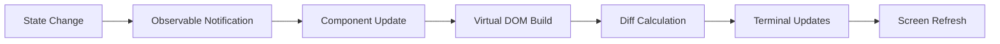
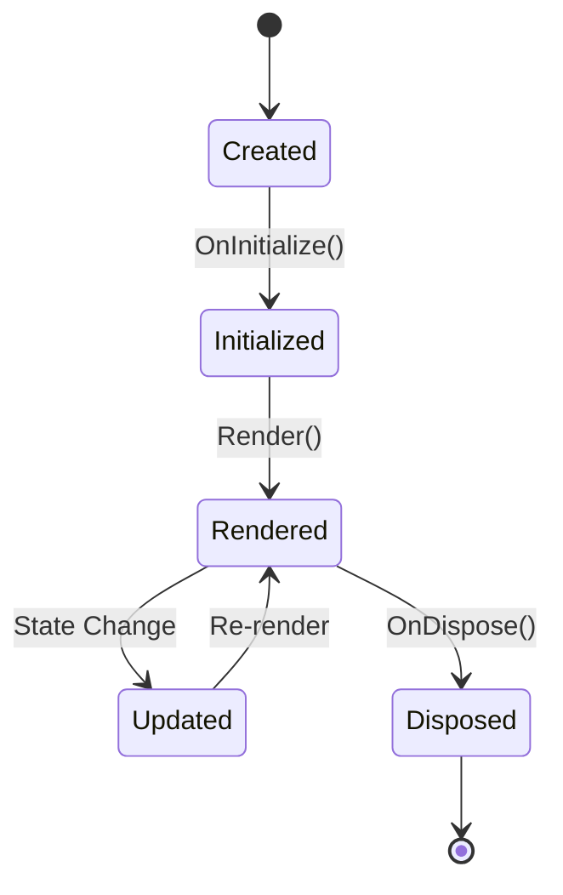

# Andy.TUI Architecture Documentation

## Overview

Andy.TUI is a reactive terminal user interface library for .NET that provides a declarative, component-based approach to building dynamic terminal applications. The library draws inspiration from modern UI frameworks like WPF, SwiftUI, and React, adapting their reactive patterns to the constraints of terminal environments.

## Core Design Principles

### 1. Reactive Data Binding
- **Observable Properties**: All UI state is managed through observable properties that automatically trigger re-renders when changed
- **Computed Properties**: Derived values that automatically update when their dependencies change
- **Dependency Tracking**: Automatic tracking of property access during render to establish reactive dependencies

### 2. Virtual DOM for Terminals
- **Virtual Nodes**: Lightweight representation of the terminal UI structure
- **Differential Rendering**: Efficient updates by comparing virtual trees and applying minimal changes
- **Render Scheduling**: Batched updates to minimize terminal flicker and improve performance

### 3. Component-Based Architecture
- **Composable Components**: UI elements built as reusable, self-contained components
- **Lifecycle Management**: Components with initialization, update, and disposal phases
- **Context Propagation**: Shared state and services passed down the component tree

## Architecture Layers

### 1. Core Layer (`Andy.TUI.Core`)
Foundation types and interfaces that define the reactive system:

```
Andy.TUI.Core/
├── Observable/
│   ├── IObservableProperty.cs          # Base interface for observable properties
│   ├── ObservableProperty.cs           # Thread-safe observable value container
│   ├── IComputedProperty.cs            # Interface for computed properties
│   ├── ComputedProperty.cs             # Auto-updating derived values
│   ├── ObservableCollection.cs         # Observable collection with batch operations
│   ├── ObservableCollectionExtensions.cs # LINQ integration helpers
│   ├── DependencyTracker.cs            # Automatic dependency tracking
│   └── PropertyChangedEventArgs.cs     # Event args for property changes
├── VirtualDom/
│   ├── VirtualNode.cs                   # Base class for all virtual nodes
│   ├── TextNode.cs                      # Text content nodes
│   ├── ElementNode.cs                   # UI element nodes with props/children
│   ├── FragmentNode.cs                  # Grouping without wrapper element
│   ├── ComponentNode.cs                 # Reusable component instances
│   ├── VirtualDomBuilder.cs             # Fluent API for building trees
│   ├── DiffEngine.cs                    # Tree comparison and patch generation
│   ├── Patch.cs                         # Base patch class
│   └── Patches/                         # Specific patch types
│       ├── ReplacePatch.cs
│       ├── UpdatePropsPatch.cs
│       ├── UpdateTextPatch.cs
│       ├── InsertPatch.cs
│       ├── RemovePatch.cs
│       ├── MovePatch.cs
│       └── ReorderPatch.cs
├── Components/
│   ├── IComponent.cs
│   ├── ComponentBase.cs
│   └── LifecycleManager.cs
└── Rendering/
    ├── IRenderContext.cs
    ├── RenderScheduler.cs
    └── TerminalRenderer.cs
```

#### Observable System Details

The Observable system is the heart of Andy.TUI's reactivity:

**ObservableProperty<T>**
- Thread-safe implementation with lock-based synchronization
- Weak reference support for event handlers to prevent memory leaks
- Value equality checking to avoid unnecessary notifications
- Explicit disposal pattern for cleanup

**ComputedProperty<T>**
- Automatically tracks dependencies during computation
- Lazy evaluation - only computes when accessed
- Invalidation propagation from dependencies
- Circular dependency detection
- Efficient recomputation only when dependencies change

**ObservableCollection<T>**
- Extends .NET's built-in ObservableCollection
- Batch operations (AddRange, RemoveRange) with single notification
- Notification suspension for bulk updates
- Thread-safe operations
- Integration with dependency tracking for computed properties

**DependencyTracker**
- Thread-local tracking context
- Automatic dependency discovery during property access
- Supports nested computed property scenarios
- Minimal overhead when not in tracking context

### 2. Components Layer (`Andy.TUI.Components`)
Built-in UI components and layouts:

```
Andy.TUI.Components/
├── Layout/
│   ├── Box.cs
│   ├── Stack.cs
│   ├── Grid.cs
│   ├── ScrollView.cs
│   └── SplitPane.cs
├── Input/
│   ├── TextInput.cs
│   ├── TextArea.cs
│   ├── Button.cs
│   └── Select.cs
├── Display/
│   ├── Text.cs
│   ├── ProgressBar.cs
│   ├── Spinner.cs
│   └── Table.cs
├── Containers/
│   ├── Modal.cs
│   ├── Tabs.cs
│   └── Accordion.cs
└── Specialized/
    ├── DiffViewer.cs
    ├── LogViewer.cs
    └── MetricsDisplay.cs
```

### 3. Terminal Abstraction Layer (`Andy.TUI.Terminal`)
Platform-agnostic terminal operations:

```
Andy.TUI.Terminal/
├── ITerminal.cs
├── TerminalCapabilities.cs
├── Input/
│   ├── KeyboardManager.cs
│   ├── MouseManager.cs
│   └── InputEvent.cs
├── Output/
│   ├── TerminalBuffer.cs
│   ├── ColorPalette.cs
│   └── AnsiRenderer.cs
└── Platform/
    ├── WindowsTerminal.cs
    ├── UnixTerminal.cs
    └── MacOSTerminal.cs
```

### 4. Application Framework (`Andy.TUI.Framework`)
High-level application structure and services:

```
Andy.TUI.Framework/
├── Application.cs
├── Window.cs
├── Navigation/
│   ├── NavigationService.cs
│   └── Route.cs
├── Commands/
│   ├── ICommand.cs
│   ├── RelayCommand.cs
│   └── AsyncCommand.cs
├── Services/
│   ├── ThemeService.cs
│   ├── LocalizationService.cs
│   └── ConfigurationService.cs
└── Hosting/
    ├── TuiHost.cs
    └── ServiceCollectionExtensions.cs
```

## Observable System Usage

### Basic Observable Properties

```csharp
// Create an observable property
var name = new ObservableProperty<string>("John");
var age = new ObservableProperty<int>(25);

// Subscribe to changes
name.ValueChanged += (s, e) => 
    Console.WriteLine($"Name changed from {e.OldValue} to {e.NewValue}");

// Update value - triggers notifications
name.Value = "Jane";
```

### Computed Properties

```csharp
// Create observable source properties
var firstName = new ObservableProperty<string>("John");
var lastName = new ObservableProperty<string>("Doe");

// Create computed property that depends on others
var fullName = new ComputedProperty<string>(() => 
    $"{firstName.Value} {lastName.Value}");

// Computed property automatically updates
Console.WriteLine(fullName.Value); // "John Doe"
firstName.Value = "Jane";
Console.WriteLine(fullName.Value); // "Jane Doe" - automatically updated
```

### Observable Collections

```csharp
// Create an observable collection
var items = new ObservableCollection<TodoItem>();

// Create computed properties based on collection
var totalCount = new ComputedProperty<int>(() => items.Count);
var completedCount = new ComputedProperty<int>(() => 
    items.Count(item => item.IsCompleted));

// Batch operations with single notification
items.AddRange(new[] { item1, item2, item3 });

// Suspend notifications for multiple operations
using (items.SuspendNotifications())
{
    items.Add(item4);
    items.Remove(item1);
    items[0] = updatedItem;
} // Single reset notification fired here
```

### Memory Management

```csharp
// Properties support weak references to prevent leaks
var property = new ObservableProperty<int>(42);

// Subscribe returns IDisposable for cleanup
var subscription = property.Subscribe(value => 
    Console.WriteLine($"Value: {value}"));

// Dispose when done
subscription.Dispose();

// Or use Observe for immediate + future values
using (property.Observe(value => ProcessValue(value)))
{
    // Callback invoked immediately with current value
    // and on all future changes until disposed
}
```

## Virtual DOM System

The Virtual DOM provides an efficient abstraction for terminal UI updates:

### Virtual Node Types

1. **TextNode**: Simple text content
2. **ElementNode**: UI elements with properties and children
3. **FragmentNode**: Groups nodes without adding wrapper elements
4. **ComponentNode**: Reusable component instances

### Diff Algorithm

The diffing engine uses a sophisticated algorithm to minimize terminal updates:

1. **Type Comparison**: Different node types trigger full replacement
2. **Property Diffing**: Only changed properties are updated
3. **Keyed Reconciliation**: Efficient list reordering using stable keys
4. **Depth-First Traversal**: Generates patches in application order

### Patch Types

- **Replace**: Swap entire subtree
- **UpdateProps**: Modify element properties
- **UpdateText**: Change text content
- **Insert/Remove**: Add or delete nodes
- **Move**: Relocate node within parent
- **Reorder**: Batch move operations for lists

### Builder API

The fluent builder API makes constructing virtual DOM trees intuitive:

```csharp
var ui = VBox()
    .WithClass("container")
    .WithChildren(
        Label().WithText("Hello World"),
        Button()
            .WithText("Click Me")
            .OnClick(() => HandleClick())
    )
    .Build();
```

## Key Features

### 1. Reactive Rendering Pipeline



### 2. Component Lifecycle



### 3. Layout System

The layout system supports flexible, responsive designs:

- **Flexbox-like Layout**: Direction, alignment, justification
- **Grid Layout**: Row/column-based positioning
- **Absolute Positioning**: For overlays and modals
- **Responsive Sizing**: Percentage-based and constraint-based sizing

### 4. Styling and Theming

- **Style Properties**: Foreground/background colors, text decorations
- **Theme System**: Centralized color schemes and style definitions
- **Style Inheritance**: Cascading styles through component tree
- **Dynamic Themes**: Runtime theme switching

### 5. Performance Optimizations

- **Render Caching**: Cache rendered output for static components
- **Viewport Culling**: Only render visible portions of scrollable content
- **Batch Updates**: Collect multiple state changes before rendering
- **Minimal Redraws**: Smart diffing to update only changed regions

## Integration Points

### 1. Andy CLI Integration

The library will integrate with Andy CLI through:

- **Service Registration**: Register TUI services in DI container
- **Component Hosting**: Host TUI components within CLI commands
- **State Synchronization**: Share observable state between CLI and TUI
- **Event Routing**: Route CLI events to TUI components

### 2. Tool Integration

Support for displaying tool execution:

- **Tool Status Components**: Real-time tool execution status
- **Progress Tracking**: Visual progress indicators for long-running tools
- **Log Streaming**: Live log display with filtering and search
- **Metrics Visualization**: Charts and graphs for tool metrics

### 3. LLM Integration

Specialized components for LLM interactions:

- **Message Components**: Display user/assistant/system messages
- **Streaming Text**: Handle incremental text generation
- **Token Counter**: Real-time token usage display
- **Context Indicator**: Show current conversation context

## Example Component Structure

```csharp
public class ChatInterface : ComponentBase
{
    private readonly ObservableProperty<string> _input = new("");
    private readonly ObservableCollection<Message> _messages = new();
    private readonly ComputedProperty<int> _tokenCount;
    
    public ChatInterface()
    {
        _tokenCount = new ComputedProperty<int>(() => 
            _messages.Sum(m => m.TokenCount));
    }
    
    protected override VirtualNode Render()
    {
        return VBox(
            // Header
            HBox(
                Text("Andy Assistant").Bold(),
                Spacer(),
                Text($"Tokens: {_tokenCount.Value}")
            ).Padding(1),
            
            // Messages
            ScrollView(
                VBox(_messages.Select(RenderMessage))
            ).Flex(1),
            
            // Input
            TextInput(_input)
                .Placeholder("Type your message...")
                .OnSubmit(HandleSubmit)
        );
    }
    
    private VirtualNode RenderMessage(Message message) => 
        message.Role switch
        {
            "user" => UserMessage(message),
            "assistant" => AssistantMessage(message),
            _ => SystemMessage(message)
        };
}
```

## Performance Considerations

### 1. Memory Management
- Object pooling for virtual nodes
- Weak references for event handlers
- Automatic disposal of subscriptions

### 2. Rendering Efficiency
- Double buffering to prevent flicker
- Incremental rendering for large lists
- Throttled updates for rapid state changes

### 3. Terminal Compatibility
- Feature detection for terminal capabilities
- Graceful degradation for limited terminals
- Fallback rendering modes

## Testing Strategy

### 1. Unit Testing
- Test individual components in isolation
- Mock terminal interface for consistent testing
- Property-based testing for reactive behaviors

### 2. Integration Testing
- Test component interactions
- Verify render output matches expectations
- Test keyboard/mouse input handling

### 3. Visual Regression Testing
- Capture rendered output as snapshots
- Compare against baseline renders
- Automated visual diff detection

## Future Enhancements

### 1. Advanced Features
- Animation support with easing functions
- Gesture recognition for touch terminals
- Accessibility features (screen reader support)
- Plugin system for custom components

### 2. Performance Improvements
- WebAssembly rendering for web terminals
- GPU-accelerated rendering where available
- Parallel rendering for multi-core systems

### 3. Developer Experience
- Hot reload for component development
- Visual designer for layout creation
- Component library marketplace
- Debugging tools and profilers