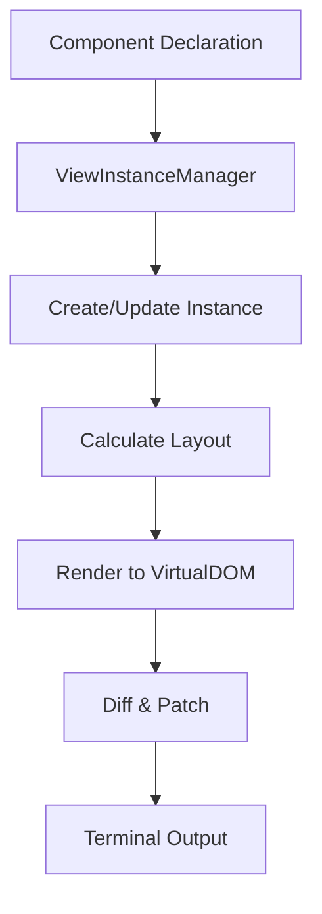

# Andy.TUI Declarative Architecture

## Overview

Andy.TUI's declarative framework combines the best features from multiple UI paradigms:
- **Ink's rich component library** and developer experience
- **Yoga's flexbox layout engine** for precise positioning
- **SwiftUI's type safety** and declarative syntax
- **WPF's MVVM patterns** and data binding

## Core Architecture

### 1. Component Declaration vs Instance Separation

Similar to SwiftUI, we separate view declarations from their runtime instances:

```csharp
// Declaration - lightweight, immutable description
public class Box : ISimpleComponent
{
    public FlexDirection FlexDirection { get; set; }
    public JustifyContent JustifyContent { get; set; }
    // ... other properties
}

// Instance - stateful, manages layout and rendering
public class BoxInstance : ViewInstance
{
    protected override LayoutBox PerformLayout(LayoutConstraints constraints)
    {
        // Flexbox layout calculation
    }
    
    protected override VirtualNode RenderWithLayout(LayoutBox layout)
    {
        // Render using calculated positions
    }
}
```

### 2. Layout System

#### Layout Types

- **Length**: Flexible sizing with pixels, percentages, or auto
  ```csharp
  Width = 100;                    // 100 pixels
  Width = Length.Percentage(50);  // 50% of parent
  Width = Length.Auto;            // Size to content
  ```

- **Spacing**: Margin/padding with individual side control
  ```csharp
  Padding = 10;                              // All sides
  Padding = new Spacing(10, 20);            // Vertical, horizontal
  Margin = Spacing.Horizontal(15);          // Left and right only
  ```

- **LayoutBox**: Calculated position and size after layout
- **LayoutConstraints**: Min/max bounds passed during layout

#### Layout Algorithm

1. **Constraint Propagation**: Parent passes constraints to children
2. **Size Calculation**: Children determine their preferred size
3. **Flex Distribution**: Available space distributed to flex items
4. **Alignment**: Items positioned according to justify/align rules
5. **Absolute Positioning**: Final terminal coordinates calculated

### 3. Component Hierarchy

```
ISimpleComponent (Declaration)
    ├── Box (Flexbox container)
    ├── Text (Styled text)
    ├── TextField (Input field)
    ├── Button (Interactive button)
    ├── Dropdown<T> (Selection list)
    └── ... more components

ViewInstance (Runtime)
    ├── BoxInstance
    ├── TextInstance
    ├── TextFieldInstance
    ├── ButtonInstance
    ├── DropdownInstance<T>
    └── ... more instances
```

### 4. Rendering Pipeline



## Key Features

### 1. SwiftUI-like Collection Initializers

```csharp
var ui = new Box {
    new Text("Hello").Bold(),
    new Box { 
        // Nested content
    }.Padding(10),
    new Button("Click Me", OnClick)
};
```

### 2. Fluent API for Styling

```csharp
new Box()
    .Direction(FlexDirection.Column)
    .Justify(JustifyContent.Center)
    .Align(AlignItems.Center)
    .WithPadding(20)
    .WithGap(10)
```

### 3. Strong Typing with Generics

```csharp
new Dropdown<Country>("Select country", countries, selectedCountry)
    .DisplayText(c => c.Name)
    .OnSelect(c => HandleCountrySelection(c))
```

### 4. Two-way Data Binding

```csharp
public class MyView : Component
{
    private string name = "";
    
    protected override ISimpleComponent Body =>
        new TextField("Name", this.Bind(() => name))
            .OnChange(() => Validate());
}
```

### 5. Layout Flexibility

```csharp
new Box {
    new Text("Fixed").WithWidth(100),
    new Text("Flexible").Grow(1),
    new Text("Percentage").WithWidth(Length.Percentage(25))
}
```

## Component Library (Planned)

### Core Components
- **Box**: Flexbox container (implemented)
- **Text**: Styled text output (implemented)
- **Newline**: Line break
- **Spacer**: Flexible space
- **Static**: Non-rerendering area
- **Transform**: Text transformations

### Input Components
- **TextField**: Single-line input (implemented)
- **TextArea**: Multi-line input
- **SelectInput**: List selection
- **MultiSelectInput**: Multiple selection
- **Checkbox**: Boolean toggle
- **RadioGroup**: Single choice from options

### Display Components
- **Button**: Interactive button (implemented)
- **Dropdown**: Selection dropdown (implemented)  
- **Table**: Data tables with sorting
- **List**: Ordered/unordered lists
- **ProgressBar**: Progress indication
- **Spinner**: Loading animation
- **Badge**: Status indicators
- **Gradient**: Color gradients
- **BigText**: ASCII art text

### Layout Components
- **HStack**: Horizontal stack (implemented)
- **VStack**: Vertical stack (implemented)
- **ZStack**: Layered stack
- **Grid**: Grid layout
- **ScrollView**: Scrollable area
- **Modal**: Overlay dialogs
- **Tabs**: Tab navigation

## Hook System (Planned)

Following React's hook pattern with C# adaptations:

```csharp
public class Counter : Component
{
    protected override ISimpleComponent Body()
    {
        var (count, setCount) = UseState(0);
        
        UseEffect(() => {
            var timer = SetInterval(() => setCount(c => c + 1), 1000);
            return () => ClearInterval(timer);
        }, Array.Empty<object>());
        
        return new Text($"Count: {count}");
    }
}
```

### Planned Hooks
- `UseState<T>`: Component state
- `UseEffect`: Side effects
- `UseMemo<T>`: Memoization
- `UseCallback`: Callback memoization
- `UseContext<T>`: Context values
- `UseInput`: Keyboard input
- `UseFocus`: Focus management
- `UseTheme`: Theme access

## Performance Optimizations

1. **Layout Caching**: Layouts recalculated only when needed
2. **Virtual DOM Diffing**: Minimal terminal updates
3. **Component Memoization**: Skip unchanged subtrees
4. **Batch Updates**: Group multiple state changes
5. **Lazy Rendering**: Render only visible content

## Future Enhancements

1. **Animation System**
   - Property animations with easing
   - Layout transitions
   - Enter/exit animations

2. **Theme System**
   - Global theme context
   - Component theme variants
   - Dark/light mode support

3. **Developer Tools**
   - Component inspector
   - Layout debugger
   - Performance profiler

4. **Advanced Layout**
   - CSS Grid-like layout
   - Absolute positioning
   - Sticky positioning

This architecture provides a solid foundation for building complex terminal UIs with the ease of modern declarative frameworks while maintaining the performance and type safety expected from .NET applications.